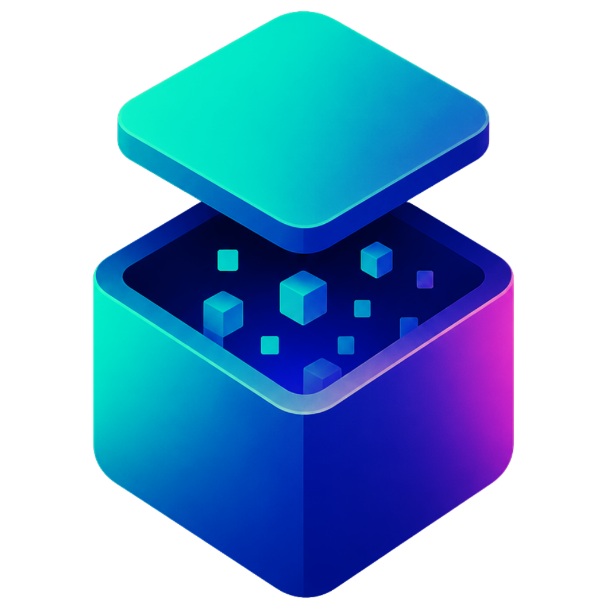
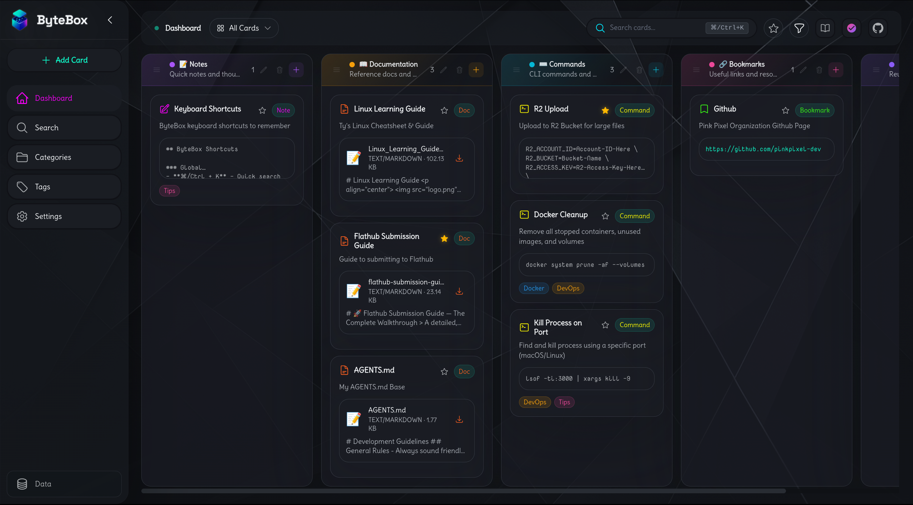

  

> A **lightweight web dashboard** for developer resources — your personal dev toolkit in one beautiful place.

All the tools you wish you had in one sleek dashboard – your code editor, control center, secondary brain, digital catch-all, and organization machine. ByteBox is a minimalistic web app designed for all developers who collect useful information. Links. APIs. Code snippets. Commands. Documentation. Screenshots. Notes that you will absolutely need someday. Don’t keep it all scattered across 37 browser tabs and numerous markdown files anymore – ByteBox brings order to all that mess with glassmorphism, quick navigation, and an easily customizable interface.

---

# **Features**

## **Built For Dev Brain Chaos**

ByteBox allows you to organize everything that matters but feels totally chaotic that you collect as a developer without the pain of enterprise software from the year 2009\.

### **Boards & Organization**

* Draggable Kanban-style boards and cards  
* Draggable columns – resize how you wish\!  
* Sort by projects, stacks, topics, or anything your caffeinated brain comes up with.  
* Automatically saves everything\!

### **Views**

Toggle between:

* All Cards  
* Recent  
* Starred  
* By Tag

We added keyboard shortcuts too because clicking everything makes you tired.

### **Tags**

* Supports multiple tags  
* Categorization with color filters  
* AND / OR Logic  
* Filtering is fast, no page reloading shenanigans required.

### **Search**

Just press Cmd/Ctrl \+ K and bring up the search overlay like you just cast an incantation from a forbidden book of spells.  
Searches for:

* Title  
* Description  
* Tags  
* Snippet/commands  
* Notes  
* Pretty much everything you have collected as a developer.

### **Favorites**

Mark those “I’m going to forget about this tomorrow” resources as your favorite.

### **Snippets & Commands**

* Syntax highlighting with 100+ languages  
* Click-to-copy buttons.

Good for:

* Shell commands  
* API snippets  
* Configuration files  
* And those cursed regexes found on Stack Overflow at 2 AM

### **Images**

Capture screenshots, diagrams, UX/UI design ideas, memes, bug reports or any screen that proves production was working before.  
Features include:

* Drag-and-drop uploads  
* Fullscreen Lightbox view  
* Downloads  
* Copy-to-clipboard  
* Image Compression

### **Full CRUD**

Create, Update, Delete, Reorganize…  
---

## **Customization & Glass UI**

ByteBox is aggressively customizable. Like, “spent 45 minutes choosing gradients instead of working” customizable.

## **Themes & Appearance**

### **Glassmorphism**

* Frosted glass UI  
* Adjustable transparency  
* Blur controls  
* Accent-aware tinting

### **Accent Themes**

Includes built-in palettes like:

* Byte Classic  
* Neon Night  
* Rainbow Sprint  
* Midnight Carbon  
* Sunset Espresso  
* Pastel Haze

Or build your own custom palette.

### **Icon Palettes**

Swap icon styles and colors independently from the UI theme.

### **Background Playground**

Use:

* solid colors  
* gradients  
* wallpaper presets  
* uploaded custom wallpapers

Basically your dashboard can become:

* a hacker cave  
* soft pastel dreamland  
* synthwave arcade  
* espresso-fueled terminal bunker

### **Typography Controls**

Mix and match:

* 17 UI fonts  
* 13 mono fonts  
* adjustable font sizes

Because typography nerds deserve happiness too.

### **Layout Controls**

Resize:

* sidebar width  
* board columns

Save everything as reusable presets.

---

## **Data & Persistence**

## **SQLite Powered**

Fast local database using SQLite \+ Prisma.

No bloated infrastructure.

## **Export / Import**

Backup everything as JSON and restore whenever you want.

## **Persistent Settings**

Themes, layouts, fonts, wallpapers, filters... all saved to the database so your setup survives browser cache purges and accidents.

---

# **Tech Stack**

| Category | Technology |
| ----- | ----- |
| Framework | Next.js 16 |
| Language | TypeScript 5 |
| Styling | Tailwind CSS 4 |
| Database | SQLite \+ Prisma |
| Drag & Drop | @dnd-kit |
| Syntax Highlighting | Shiki |
| UI Components | Headless UI |
| Icons | Heroicons |

Modern stack. Fast dev experience. Minimal nonsense.

---

# **Installation**

## **Desktop App (Recommended)**

No Docker. No Node setup. No dependency goblins living under your desk.

Just install and go.

| Platform | Download |
| ----- | ----- |
| Windows (.exe) | [ByteBox.Setup.2.5.2.exe](https://pub-52c1c4beebd34721b63e30b05b1b04de.r2.dev/ByteBox.Setup.2.5.2.exe) |
| Linux AppImage | [ByteBox-2.5.2.AppImage](https://pub-52c1c4beebd34721b63e30b05b1b04de.r2.dev/ByteBox-2.5.2.AppImage) |
| Linux .deb | [bytebox\_2.5.2\_amd64.deb](https://pub-52c1c4beebd34721b63e30b05b1b04de.r2.dev/bytebox_2.5.2_amd64.deb) |

### **Linux AppImage**

chmod \+x ByteBox-2.5.2.AppImage  
./ByteBox-2.5.2.AppImage

### **Linux .deb**

sudo dpkg \-i bytebox\_2.5.2\_amd64.deb

Database locations:

* Linux: `~/.config/ByteBox/bytebox.db`  
* Windows: `%APPDATA%\ByteBox\bytebox.db`

---

## **Docker**

git clone https://github.com/pinkpixel-dev/bytebox.git  
cd bytebox  
docker compose up \--build \-d

Open:

http://localhost:1334

Useful commands:

docker compose down  
docker compose up \-d  
docker compose up \--build \-d  
docker compose logs \-f

---

## **Run From Source**

### **Requirements**

* Node.js 18+  
* npm / pnpm / yarn

### **Quick Setup**

git clone https://github.com/pinkpixel-dev/bytebox.git  
cd bytebox  
npm run setup  
npm run dev

The setup script automatically:

* creates `.env`  
* installs dependencies  
* generates Prisma client  
* runs migrations  
* seeds example data

Open:

http://localhost:1334

### **Manual Setup**

cp .env.example .env  
npm install  
npx prisma generate  
npx prisma migrate deploy  
npm run db:seed  
npm run dev

---

# **Usage**

## **Keyboard Shortcuts**

| Shortcut | Action |
| ----- | ----- |
| `Cmd/Ctrl + K` | Open search |
| `Cmd/Ctrl + 1-4` | Switch views |
| `Cmd/Ctrl + Shift + S` | Toggle starred filter |
| `Esc` | Close modals |

---

## **Creating Cards**

Click **\+ New Card** and choose a type:

* 📑 Bookmark  
* 💻 Code Snippet  
* ⌘ Command  
* 📚 Documentation  
* 🖼️ Image  
* 📝 Note

Then add:

* title  
* description  
* tags  
* content  
* syntax language (optional)

Done. Organized. Brain happier.

---

## **Drag & Drop**

Move cards around like a caffeinated Tetris champion.

* reorder cards  
* move between categories  
* reorganize columns

Everything persists automatically.

---

## **Search Everything**

Search updates in real-time and works across basically the whole app.

---

## **Export & Import**

Backup your entire setup with a single click.

Import merges data instead of wiping it out.

---

## **🗂️ Project Structure**

bytebox/  
├── src/  
├── prisma/  
├── public/  
├── scripts/  
├── README.md  
├── CHANGELOG.md  
├── CONTRIBUTING.md  
├── ROADMAP.md  
└── LICENSE

Clean-ish. Organized-ish. Developer-approved.

---

# **Contributing**

Contributions are welcome\! 🎉

Check out:

CONTRIBUTING.md

for contribution guidelines.

---

# **License**

Licensed under the **Apache License 2.0**.

---

# **Credits**

Built by **Pink Pixel** 🌸

* Website: [https://pinkpixel.dev](https://pinkpixel.dev/)  
* GitHub: [https://github.com/pinkpixel-dev](https://github.com/pinkpixel-dev)  
* Discord: @sizzlebop  
* Email: admin@pinkpixel.dev  
* Buy me a coffee: [https://www.buymeacoffee.com/pinkpixel](https://www.buymeacoffee.com/pinkpixel)

---

If you find ByteBox useful, please consider starring the repo.
